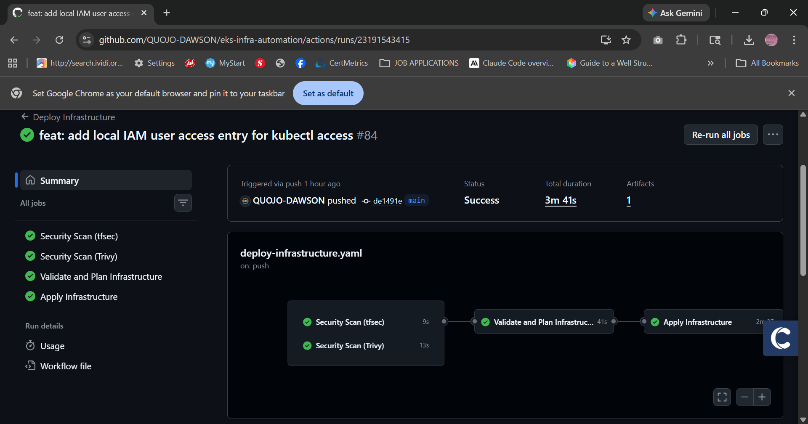
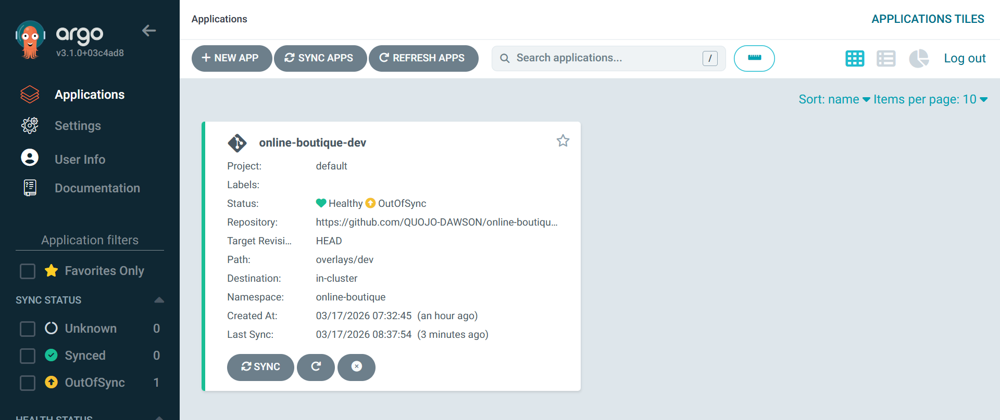
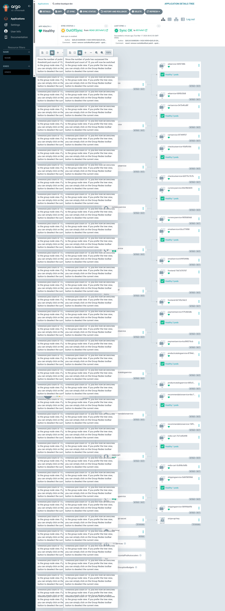
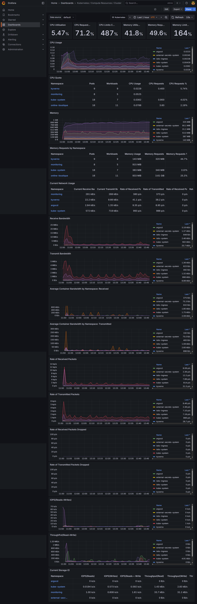

# eks-infra-automation

> Production-grade EKS platform built with Terraform, secured with Kyverno, observed with Prometheus/Grafana, and delivered via GitOps with ArgoCD. Built to production standards: multi-AZ HA, zero-trust security, GitOps delivery, and full observability.

---

## What This Is

This repo provisions and manages a complete Kubernetes platform on AWS EKS — from the VPC up. It is not a tutorial follow-along. Every design decision reflects how platform teams at scale operate: security scanning in CI before a single resource is created, policy enforcement at admission time, GitOps as the only path to production, and observability baked in from day one.

The platform runs the [Online Boutique](https://github.com/gdawsonkesson/online-boutique-gitops) microservices application — an 11-service e-commerce demo — as the workload, with full Istio service mesh, HPA, PodDisruptionBudgets, and NetworkPolicies applied across the board.

---

## Architecture
```
+-----------------------------------------------------------------+
¦                        GitHub Actions CI/CD                      ¦
¦  tfsec ? Trivy ? Terraform Plan ? Phase 1 ? Phase 1.5 ? Phase 2 ¦
+-----------------------------------------------------------------+
                              ¦ OIDC (no long-lived credentials)
                              ?
+-----------------------------------------------------------------+
¦                          AWS (us-east-2)                         ¦
¦                                                                  ¦
¦  +----------------------------------------------------------+   ¦
¦  ¦                    VPC (3 AZs)                            ¦   ¦
¦  ¦  Public Subnets (NAT GW, ALB)                            ¦   ¦
¦  ¦  Private Subnets (EKS Nodes)                             ¦   ¦
¦  +----------------------------------------------------------+   ¦
¦                                                                  ¦
¦  +----------------------------------------------------------+   ¦
¦  ¦              EKS 1.33 (Managed Node Group)                ¦   ¦
¦  ¦  t3.medium | desired=1 | min=1 | max=5 | KMS encrypted   ¦   ¦
¦  ¦                                                           ¦   ¦
¦  ¦  Platform Layer (Helm)          Workload Layer (ArgoCD)  ¦   ¦
¦  ¦  +-- ArgoCD v3.1.0              +-- online-boutique       ¦   ¦
¦  ¦  +-- Kyverno 3.2.6                  +-- 11 microservices ¦   ¦
¦  ¦  +-- Istio 1.26.2                   +-- Istio sidecar    ¦   ¦
¦  ¦  +-- kube-prometheus-stack          +-- HPA per service  ¦   ¦
¦  ¦  +-- AWS Load Balancer Controller   +-- PDB per service  ¦   ¦
¦  ¦  +-- Cluster Autoscaler             +-- NetworkPolicies  ¦   ¦
¦  ¦  +-- External Secrets Operator                           ¦   ¦
¦  ¦  +-- Metrics Server                                      ¦   ¦
¦  +----------------------------------------------------------+   ¦
¦                                                                  ¦
¦  S3 (Terraform state) ¦ Secrets Manager ¦ IAM IRSA              ¦
+-----------------------------------------------------------------+
```

---

## Screenshots

| What | Screenshot |
|------|-----------|
| GitHub Actions — all green |  |
| ArgoCD — Online Boutique Healthy |  |
| ArgoCD — Full Resource Tree |  |
| Grafana — Kubernetes Cluster Metrics |  |

---

## Stack

| Layer | Technology |
|-------|-----------|
| Cloud | AWS (us-east-2) |
| IaC | Terraform 1.12 |
| Kubernetes | EKS 1.33 |
| CI/CD | GitHub Actions + OIDC |
| GitOps | ArgoCD v3.1.0 |
| Policy | Kyverno 3.2.6 |
| Service Mesh | Istio 1.26.2 |
| Observability | Prometheus + Grafana (kube-prometheus-stack 76.4.0) |
| Secrets | External Secrets Operator + AWS Secrets Manager |
| Ingress | AWS Load Balancer Controller 1.13.3 |
| Autoscaling | Cluster Autoscaler + HPA |
| State Backend | S3 + native locking |
| Image Scanning | Trivy (IaC + secrets) |
| SAST | tfsec |

---

## Repository Structure
```
eks-infra-automation/
+-- .github/
¦   +-- workflows/
¦       +-- deploy-infrastructure.yaml        # Main CI/CD pipeline
¦       +-- destroy-infrastructure.yaml       # Manual teardown (requires DESTROY input)
+-- docs/
¦   +-- screenshots/                          # Sprint 2 verification evidence
+-- argocd.tf                                 # ArgoCD Helm release
+-- aws-load-balancer-controller.tf           # ALB Controller Helm release + IRSA
+-- cluster-autoscaler.tf                     # Cluster Autoscaler Helm release + IRSA
+-- eks-local-access.tf                       # Local IAM user EKS access entry
+-- eks-main.tf                               # VPC + EKS cluster + node group
+-- external-secrets.tf                       # External Secrets Operator + IRSA
+-- iam-roles.tf                              # External admin/developer IAM roles
+-- istio.tf                                  # Istio base, istiod, ingress gateway
+-- istio-gateway-values.yaml                 # Istio ingress gateway Helm values
+-- kube-resources.tf                         # Kubernetes namespace resources
+-- kyverno.tf                                # Kyverno Helm release
+-- kyverno-policies.tf                       # Admission control ClusterPolicies
+-- metrics-server.tf                         # Metrics Server Helm release
+-- network-policies.tf                       # Namespace-level NetworkPolicies
+-- outputs.tf                                # Terraform outputs
+-- prometheus.tf                             # kube-prometheus-stack config
+-- providers.tf                              # AWS, Kubernetes, Helm, Time providers
+-- reliability.tf                            # PodDisruptionBudgets
+-- terraform.tfvars                          # Variable values
+-- variables.tf                              # Input variable definitions
```

---

## CI/CD Pipeline

Every push to `main` runs through four sequential jobs with no manual gates:
```
Security Scan (tfsec)  --+
                          +--? Validate & Plan --? Apply Infrastructure
Security Scan (Trivy)  --+
```

The apply itself runs in three phases to handle Kubernetes CRD bootstrapping:

**Phase 1** — AWS infrastructure: VPC, EKS cluster, node groups, IAM roles, KMS encryption

**Phase 1.5** — Kyverno Helm install only: ensures CRDs are registered before policies are applied (solves the `no matches for kind "ClusterPolicy"` race condition)

**Phase 2** — Full platform: all remaining Helm releases, Kyverno policies, NetworkPolicies, PDBs

Authentication uses OIDC — no AWS access keys are stored anywhere.

---

## Security

### Admission Control (Kyverno)

| Policy | Mode | What it enforces |
|--------|------|-----------------|
| `disallow-privileged-containers` | Enforce | No privileged pods cluster-wide |
| `disallow-host-namespaces` | Enforce | No hostPID/hostIPC/hostNetwork (system namespaces excluded) |
| `disallow-latest-tag` | Enforce | All images in online-boutique must use explicit tags |
| `require-resource-limits` | Audit | CPU/memory limits must be defined |
| `require-non-root-user` | Audit | Containers should run as non-root (audit mode for upstream image compatibility) |

> `require-non-root-user` is deliberately set to Audit. The Online Boutique upstream images run as root at the OS level — enforcing this would block the workload entirely. The policy detects and reports violations without blocking, which is the correct production pattern for third-party workloads you don't build yourself.

### Network Segmentation

The `online-boutique` namespace operates under a default-deny-all NetworkPolicy. Explicit allow rules permit only intra-namespace traffic, Istio control plane communication, Prometheus scraping, and DNS egress.

### Secret Management

Secrets never touch the codebase or CI environment. The External Secrets Operator pulls from AWS Secrets Manager at runtime using IRSA — the pod gets the secret, never the pipeline.

---

## Observability

Prometheus scrapes all namespaces. Grafana ships with pre-built Kubernetes dashboards:

- Kubernetes / Compute Resources / Cluster
- Kubernetes / Compute Resources / Namespace (Pods)
- Kubernetes / API Server
- Istio mesh dashboards

AlertManager is configured with Slack routing for critical alerts.

Access Grafana locally:
```bash
kubectl port-forward svc/kube-prometheus-stack-grafana -n monitoring 3000:80
# http://localhost:3000 | admin / prom-operator
```

---

## GitOps

ArgoCD manages the Online Boutique workload from a separate repo: [online-boutique-gitops](https://github.com/gdawsonkesson/online-boutique-gitops)

The platform repo provisions ArgoCD. The application repo defines what ArgoCD deploys. These concerns are intentionally separated — infrastructure engineers own this repo, application teams own theirs.
```
online-boutique-gitops/
+-- base/              # Kubernetes manifests
+-- app-config/        # ExternalSecret, VirtualService, HPA, PDB
+-- overlays/
    +-- dev/           # Dev environment (active)
    +-- staging/       # Staging overlay
    +-- prod/          # Production overlay
```

Access ArgoCD locally:
```bash
kubectl port-forward svc/argo-cd-argocd-server -n argocd 8080:443
# https://localhost:8080 | admin / (kubectl get secret argocd-initial-admin-secret -n argocd ...)
```

---

## Reliability

Every critical service in the Online Boutique has:

- **HPA** — scales on CPU, min/max replicas defined per service risk profile
- **PDB** — ensures at least 1 replica stays available during node disruptions
- **Cluster Autoscaler** — scales nodes from 1 to 5 based on pending pod pressure

---

## Local Access

After deploying, configure kubectl:
```bash
aws eks update-kubeconfig --region us-east-2 --name eks-platform-eks-cluster
kubectl get nodes
kubectl get pods -A
helm list -A
```

Your IAM identity needs an EKS access entry — see `eks-local-access.tf`.

---

## Destroy

Infrastructure teardown is a GitHub Actions manual workflow — it will not run on push.

Go to **Actions ? Destroy Infrastructure ? Run workflow** and type `DESTROY` to confirm. This prevents accidental teardown and keeps the destroy auditable.

---

## Environment Status

This infrastructure was deployed and verified live in March 2026 then destroyed after Sprint 2 verification. Every component is fully redeployable via the pipeline — trigger the Deploy Infrastructure workflow to recreate the complete stack from Terraform state.

**Last verified:** March 2026
**Cluster:** eks-platform-eks-cluster
**Region:** us-east-2
**Status:** Destroyed after verification. Redeployable via Terraform pipeline.

> Before redeploying, update `cluster_name` in `terraform.tfvars` to avoid naming conflicts with stale AWS resources from prior deployments.

## Known Issues & Honest Notes

- **Kyverno cleanup CronJob ImagePullBackOff** — a known issue with Kyverno 3.2.6 cleanup controller image tags on certain registries. Core admission control is unaffected.
- **tfsec exit code 3 annotation** — GitHub Actions annotation from the plan step using `-detailed-exitcode`. The job succeeds; this is a CI wrapper quirk, not a Terraform error.
- **`require-non-root-user` in Audit mode** — documented above under Security. This is intentional, not an oversight.

---

## What This Demonstrates

This project is a portfolio piece targeting mid-level and senior DevOps/Platform Engineering roles. It demonstrates:

- Writing production Terraform across VPC, EKS, IAM, KMS, and Helm in a single coherent codebase
- Designing a multi-phase CI/CD pipeline that handles real-world CRD bootstrapping race conditions
- Implementing defence-in-depth: scanning before apply, policy enforcement at admission, network segmentation at runtime, and secret management through IRSA
- Separating platform concerns (this repo) from application concerns (gitops repo) the way a real platform team would
- Debugging live AWS account restrictions, Helm release failures, and Kyverno policy conflicts under real conditions — not a clean-room tutorial environment

---

## Author

**George Dawson-Kesson** — AWS Certified Solutions Architect – Associate (SAA-C03)  
Portfolio: [gdawsonkesson.com](https://gdawsonkesson.com)  
GitHub: [gdawsonkesson](https://github.com/gdawsonkesson)
