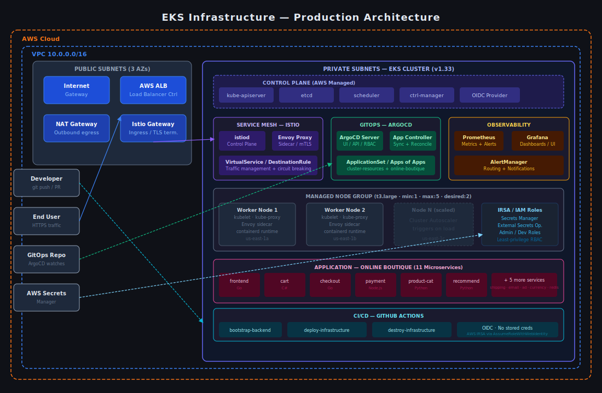

# EKS Infrastructure Automation

> **Production-grade EKS platform** — Terraform-automated Kubernetes cluster with Istio service mesh, ArgoCD GitOps delivery, Prometheus/Grafana observability, and GitHub Actions CI/CD. Deploys a full 11-service microservices workload ([Online Boutique](https://github.com/QUOJO-DAWSON/online-boutique-application)) in a reproducible, zero-manual-steps workflow.

[](https://www.terraform.io/)
[](https://kubernetes.io/)
[](https://istio.io/)
[](https://argoproj.github.io/cd/)
[](LICENSE)

---

## Problem Statement

Managing Kubernetes at scale requires more than a working cluster. Teams need **consistent, auditable deployments** (GitOps), **zero-trust networking** between services (service mesh), **early visibility into regressions** (observability), and **secrets that never touch Git** (external secrets management). Assembling these primitives from scratch on each project wastes engineering time and introduces inconsistency.

This repository delivers a **turn-key, opinionated EKS platform** that wires all four concerns together through Terraform, allowing teams to focus on application delivery rather than infrastructure plumbing. It targets the pattern used by platform engineering teams at mid-to-large companies — where a single IaC repository stands up the full cluster and its operational tooling reproducibly.

---

## Key Metrics

| Metric | Value |
|--------|-------|
| **Cluster provisioning time** | ~12 minutes (cold, from `terraform apply`) |
| **Full workload deployment** | ~3 minutes post-cluster (ArgoCD initial sync) |
| **Zero-downtime deployments** | ✅ via ArgoCD rolling sync + Istio traffic shifting |
| **Secrets in Git** | 0 — all secrets managed via AWS Secrets Manager + ESO |
| **Manual kubectl steps** | 0 — full GitOps; cluster state is 100% declarative |
| **Inter-service encryption** | 100% mTLS via Istio (zero application code changes) |
| **Terraform resources managed** | ~80 across 11 `.tf` files |

---

## Architecture



### System Overview

```
Internet → ALB → Istio Gateway → Istio VirtualService → Microservices (mTLS)
                                         ↑
GitHub Actions ──── Terraform ──── EKS Cluster
                                         ↑
GitOps Repo ──── ArgoCD ──────── Workloads + Add-ons
                                         ↑
AWS Secrets Manager ──── ESO ──── Kubernetes Secrets
```

The cluster is structured in three logical layers:

**Platform layer** — deployed by Terraform: VPC, EKS, IAM roles, Istio, ArgoCD, External Secrets Operator, Prometheus stack, Cluster Autoscaler, Metrics Server, AWS Load Balancer Controller.

**GitOps layer** — managed by ArgoCD: cluster resources (namespaces, RBAC, network policies) and the Online Boutique application, sourced from the [GitOps repo](https://github.com/QUOJO-DAWSON/online-boutique-gitops).

**Application layer** — the Online Boutique: 11 polyglot microservices (Go, Python, Node.js, C#) communicating exclusively over mTLS within the Istio mesh.

---

## Architecture Decision Records

| ADR | Decision | Status |
|-----|----------|--------|
| [ADR-001](docs/adr/001-istio-service-mesh.md) | Istio chosen over Linkerd and Cilium for service mesh | Accepted |
| [ADR-002](docs/adr/002-argocd-gitops.md) | GitOps via ArgoCD over push-based CI/CD and Flux | Accepted |
| [ADR-003](docs/adr/003-external-secrets-operator.md) | External Secrets Operator + AWS Secrets Manager over Sealed Secrets | Accepted |

---

## Repository Structure

```
eks-infra-automation/
├── .github/workflows/
│   ├── bootstrap-backend.yaml        # S3 bucket + native state locking
│   ├── deploy-infrastructure.yaml    # Plan on PR, apply on merge to main
│   └── destroy-infrastructure.yaml   # Manual teardown
├── argocd-apps/
│   ├── cluster-resources-argo-app.yaml
│   └── online-boutique-argo-app.yaml
├── backend/
│   ├── main.tf                       # S3 backend configuration
│   └── outputs.tf
├── docs/
│   ├── adr/                          # Architecture Decision Records
│   │   ├── 001-istio-service-mesh.md
│   │   ├── 002-argocd-gitops.md
│   │   └── 003-external-secrets-operator.md
│   └── img/
│       └── architecture.svg
├── argocd.tf
├── aws-load-balancer-controller.tf
├── cluster-autoscaler.tf
├── eks-main.tf                       # EKS cluster + VPC
├── external-secrets.tf
├── iam-roles.tf
├── istio.tf
├── istio-gateway-values.yaml
├── kube-resources.tf
├── metrics-server.tf
├── prometheus.tf
├── outputs.tf
├── providers.tf
├── terraform.tfvars
└── variables.tf
```

---

## Tools and Technologies

### Infrastructure as Code
| Tool | Purpose |
|------|---------|
| Terraform v1.12+ | All AWS and Kubernetes resource provisioning |
| Helm | Kubernetes package management for add-ons |
| Kustomize | Manifest customisation in the GitOps layer |

### AWS Services
| Service | Role |
|---------|------|
| Amazon EKS | Managed Kubernetes control plane |
| Amazon VPC | Multi-AZ networking (public + private subnets) |
| AWS IAM + IRSA | Least-privilege pod-level AWS access via OIDC |
| AWS ALB | External traffic ingress via Load Balancer Controller |
| AWS Secrets Manager | Centralised secrets store (ESO backend) |

### Kubernetes Platform
| Component | Role |
|-----------|------|
| Istio + Istio Gateway | mTLS, traffic management, ingress |
| ArgoCD | GitOps continuous delivery |
| Prometheus + Grafana + AlertManager | Metrics, dashboards, alerting |
| External Secrets Operator | Secrets sync from AWS Secrets Manager |
| Cluster Autoscaler | Node group horizontal scaling |
| Metrics Server | HPA metrics provider |
| AWS Load Balancer Controller | ALB/NLB provisioning from Kubernetes |
| GitHub Actions | CI/CD pipeline with OIDC (no stored credentials) |

---

## Prerequisites

- AWS CLI configured with permissions to create EKS, VPC, IAM, and S3 resources
- Terraform v1.12.0 or later
- `kubectl` CLI
- `helm` CLI
- An AWS account with an OIDC provider configured for GitHub Actions (see [GitHub OIDC setup](https://docs.github.com/en/actions/security-for-github-actions/security-hardening-your-deployments/configuring-openid-connect-in-amazon-web-services))

---

## Deployment

The repository ships three GitHub Actions workflows that run in sequence:

### Step 1 — Bootstrap the Terraform Backend

Run the **Bootstrap Backend** workflow (`workflow_dispatch`) once per AWS account. This creates the S3 bucket with native state locking used by all subsequent Terraform operations.

### Step 2 — Deploy Infrastructure

Push to `main` (or open a PR) to trigger the **Deploy Infrastructure** workflow:
- **Pull Request** → `terraform validate` + `terraform plan` (no apply)
- **Push to `main`** → `terraform apply` (full deployment)

### Step 3 — Destroy Infrastructure

Run the **Destroy Infrastructure** workflow (`workflow_dispatch`) to tear everything down cleanly.

---

### GitHub Actions — Required Secrets

| Secret | Description | Required |
|--------|-------------|----------|
| `ADMIN_USER_ARN` | ARN of the AWS IAM user granted cluster admin role | Yes |
| `DEV_USER_ARN` | ARN of the AWS IAM user granted developer (read-only) role | Yes |
| `ACTIONS_AWS_ROLE_ARN` | ARN of the IAM role GitHub Actions assumes via OIDC | Yes |
| `GITOPS_URL` | GitOps repository URL (ArgoCD source) | If private repo |
| `GITOPS_USERNAME` | Git username for ArgoCD | If private repo |
| `GITOPS_PASSWORD` | Git token for ArgoCD | If private repo |

### GitHub Actions — Required Variables

| Variable | Description | Example |
|----------|-------------|---------|
| `AWS_REGION` | Target AWS region | `us-east-1` |

> **Security note:** GitHub Actions authenticates to AWS via OIDC (`AssumeRoleWithWebIdentity`). No AWS credentials are stored as GitHub Secrets.

---

## Configuration Reference

| Variable | Description | Default |
|----------|-------------|---------|
| `aws_region` | AWS region | `us-east-1` |
| `project_name` | Resource name prefix | `eks-platform` |
| `kubernetes_version` | EKS version | `1.33` |
| `environment` | Environment tag | `dev` |
| `vpc_cidr_block` | VPC CIDR | `10.0.0.0/16` |
| `private_subnets_cidr` | Private subnet CIDRs | `["10.0.1.0/24", "10.0.2.0/24", "10.0.3.0/24"]` |
| `public_subnets_cidr` | Public subnet CIDRs | `["10.0.101.0/24", "10.0.102.0/24", "10.0.103.0/24"]` |
| `node_group_instance_types` | EC2 instance types | `["t3.large"]` |
| `node_group_min_size` | Minimum nodes | `1` |
| `node_group_max_size` | Maximum nodes | `5` |
| `node_group_desired_size` | Desired nodes | `2` |

---

## Accessing Cluster UIs

Once deployed, all UIs are accessible via `kubectl port-forward`:

| Service | Port Forward | URL | Credentials |
|---------|--------------|-----|-------------|
| ArgoCD | `kubectl port-forward -n argocd svc/argocd-server 8080:443` | https://localhost:8080 | user: `admin` / pass: `kubectl -n argocd get secret argocd-initial-admin-secret -o jsonpath="{.data.password}" \| base64 -d` |
| Prometheus | `kubectl port-forward -n monitoring svc/kube-prometheus-stack-prometheus 9090:9090` | http://localhost:9090 | None |
| Grafana | `kubectl port-forward -n monitoring svc/kube-prometheus-stack-grafana 3000:80` | http://localhost:3000 | user: `admin` / pass: `kubectl get secret -n monitoring kube-prometheus-stack-grafana -o jsonpath="{.data.admin-password}" \| base64 -d` |
| AlertManager | `kubectl port-forward -n monitoring svc/kube-prometheus-stack-alertmanager 9093:9093` | http://localhost:9093 | None |

---

## Accessing the Cluster

The cluster uses IAM-based access entries. Two roles are provisioned: `external-admin` (full access) and `external-dev` (read-only to app namespaces).

```bash
# 1. Assume the admin role
ROLE_OUTPUT=$(aws sts assume-role \
  --role-arn arn:aws:iam::<ACCOUNT_ID>:role/external-admin \
  --role-session-name eks-access \
  --profile admin)

# 2. Export temporary credentials
export AWS_ACCESS_KEY_ID=$(echo $ROLE_OUTPUT | jq -r '.Credentials.AccessKeyId')
export AWS_SECRET_ACCESS_KEY=$(echo $ROLE_OUTPUT | jq -r '.Credentials.SecretAccessKey')
export AWS_SESSION_TOKEN=$(echo $ROLE_OUTPUT | jq -r '.Credentials.SessionToken')

# 3. Configure kubectl
aws eks update-kubeconfig --region <REGION> --name <CLUSTER_NAME>
```

> These credentials are session-scoped. Run all subsequent commands in the same terminal.

---

## Related Repositories

| Repository | Purpose |
|------------|---------|
| [eks-infra-automation](https://github.com/QUOJO-DAWSON/eks-infra-automation) | This repo — cluster infrastructure |
| [online-boutique-application](https://github.com/QUOJO-DAWSON/online-boutique-application) | Microservices source code + CI pipeline |
| [online-boutique-gitops](https://github.com/QUOJO-DAWSON/online-boutique-gitops) | Kubernetes manifests watched by ArgoCD |

---

## Contributing

1. Fork the repository
2. Create a feature branch: `git checkout -b feature/your-feature`
3. Commit your changes: `git commit -m 'feat: description'`
4. Push and open a Pull Request — CI will run `terraform validate` and `terraform plan`

---

## License

[MIT](LICENSE)

